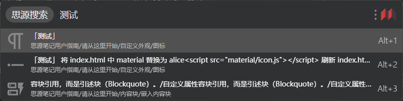

# utools-siyuan

utools 插件 - 思源笔记

通过思源笔记内核 API 进行搜索, 支持保存多个思源笔记服务端地址

## 预览

### 设置界面

### 搜索界面

## 安装

### 手动安装

在 [Releases](https://github.com/Zuoqiu-Yingyi/utools-siyuan/releases) 中下载最新的发行版安装包 `utools-siyuan-v<版本号>.upx`, 之后将文件拖动到 utools 输入框中即可安装

### 自动安装

本插件现已发布至 utools 插件应用市场, 在市场中搜索 `思源笔记` 即可安装

~~上架 utools 插件应用市场要求 `proload.js` 文件在打包时不进行混淆, 在这里诚心征集使用 `vite` 或 `rollup` 进行生产环境构建时不对代码进行压缩与混淆的方案:heart:~~
感谢 @leolee9086 的[帮助](https://github.com/Zuoqiu-Yingyi/utools-siyuan/issues/2), 已解决代码混淆与压缩问题:heart:

## 功能

### 插件设置

- 在 utools 输入框中输入 `sy-setting` / `思源插件设置` 后点击第一个搜索结果即可进入插件设置页面
- **设置发生更改后需要手动点击页面最上方的 `保存` 按钮保存设置项**
- 插件设置项
  - `连接思源客户端`: 思源笔记内核服务相关设置项
    - `思源服务`: 思源笔记内核服务地址, 可以是本地服务地址, 也可以是远程服务地址
      - `端口`: 思源笔记内核服务的端口, 可以在 `设置>关于>在浏览器上使用` 中获取
        - **注: 桌面端第一个打开的工作空间会同时监听一个随机端口与固定的 `6806` 端口**
    - `API Token`: 思源笔记内核服务的 API Token, 可以在思源笔记 `设置>关于>API Token` 中获取
      - 若服务未启用 `访问授权码` (`设置>关于>访问授权码` 为空), 则无需设置该选项
  - `搜索设置`: 插件搜索功能相关设置项
    - `搜索方案`: 插件使用的搜索方案
      - `关键字`: **默认选项**, 多个关键字使用空格分隔
      - `查询语法`: 详情请参考 [SQLite FTS5](https://www.sqlite.org/fts5.html) 与 [请从这里开始/搜索进阶/查询语法](https://publish.zuoqiu.space/widgets/url-scheme/?location=siyuan%3A%2F%2Fblocks%2F20220213230830-g1amobi)
      - `正则表达式`: 使用正则表达式匹配块的内容
      - `SQL 语句`: 使用 SQL 语句查询数据库
    - `分组方案`: 搜索结果分组方案
      - `不分组`: 按照排序方案列出搜索结果
      - `按文档分组`: **默认选项**, 同一个文档的搜索结果相邻列出
    - `排序方案`: 搜索结果排序方案
      - `块类型`: 按照搜索结果的块类型进行排序, 顺序为 `文档块` > `标题块` > `段落块` > `代码块` > `数学公式块` > `表格块` > `HTML 块` > `列表块` > `列表项块` > `引述块` > `超级块`
      - `原文内容顺序`: 仅限分组方案为 `按文档分组`
      - `相关度降序`: **默认选项**, 匹配的字符越多的搜索结果越靠前
      - `相关度升序`: 匹配的字符越少的搜索结果越靠前
      - `创建时间降序`: 创建时间越晚的搜索结果越靠前
      - `创建时间升序`: 创建时间越早的搜索结果越靠前
      - `修改时间降序`: 最后修改时间越晚的搜索结果越靠前
      - `修改时间升序`: 最后修改时间越早的搜索结果越靠前
    - `搜索目录`: 在指定文档目录下搜索
      - **默认选项** 搜索目录为空时会在所有文档目录下搜索
    - `块类型`: 搜索时仅搜索指定的块类型
  - `其他设置`: 外观等其他设置
    - `语言`: 插件界面语言
      - `English`
      - `简体中文`: **默认选项**
      - `繁体中文`
    - `主题`: 插件界面主题
      - `浅色主题`
      - `深色主题`
      - `跟随系统`: **默认选项**

### 笔记内容搜索

在 utools 输入框中输入 `sy` / `sy-search` / `思源搜索` 后点击第一个搜索结果即可进入插件设置页面

## 参考 & 感谢

| 作者                                                  | 项目                                                                                                                                                                    | 许可证    |
| :---------------------------------------------------- | :---------------------------------------------------------------------------------------------------------------------------------------------------------------------- | :-------- |
| **[renmu123](https://github.com/renmu123)**           | [renmu123/utools-obsidian-plugin: utools的obsidian插件](https://github.com/renmu123/utools-obsidian-plugin)                                                             | *Unknown* |
| **[startnothings](https://github.com/startnothings)** | [startnothings/utools-obsidian: utools的插件-obsidian笔记搜索](https://github.com/startnothings/utools-obsidian)                                                        | *Unknown* |
| **[mohuishou](https://github.com/mohuishou)**         | [mohuishou/utools: utools 插件，utools api, chrome历史记录搜索、vscode历史项目搜索、otp两步验证，iconfont图标搜索下载、语雀搜索等](https://github.com/mohuishou/utools) | *Unknown* |

注: 排序不分先后

## 主要依赖

| 作者                                                  | 项目                                                                                                                         | 许可证                                                                            |
| :---------------------------------------------------- | :--------------------------------------------------------------------------------------------------------------------------- | :-------------------------------------------------------------------------------- |
| **[vitejs](https://github.com/vitejs)**               | [vitejs/vite: Next generation frontend tooling. It's fast!](https://github.com/vitejs/vite)                                  | *[MIT license](https://github.com/vitejs/vite/blob/main/LICENSE)*                 |
| **[vuejs](https://github.com/vuejs)**                 | [vuejs/vue: This is the repo for Vue 2. For Vue 3, go to https://github.com/vuejs/core](https://github.com/vuejs/vue)        | *[MIT license](https://github.com/vuejs/vue/blob/main/LICENSE)*                   |
| **[kazupon](https://github.com/kazupon)**             | [kazupon/vue-i18n: Internationalization plugin for Vue.js](https://github.com/kazupon/vue-i18n)                              | *[MIT license](https://github.com/kazupon/vue-i18n/blob/v8.x/LICENSE)*            |
| **[arco-design](https://github.com/arco-design)**     | [arco-design/arco-design-vue: A Vue.js 3 UI Library based on Arco Design](https://github.com/arco-design/arco-design-vue)    | *[MIT license](https://github.com/arco-design/arco-design-vue/blob/main/LICENSE)* |
| **[vladshcherbin](https://github.com/vladshcherbin)** | [vladshcherbin/rollup-plugin-copy: Copy files and folders using Rollup](https://github.com/vladshcherbin/rollup-plugin-copy) | *Unknown*                                                                         |

注: 按引入时间排序

## 更改日志

[CHANGELOG](https://github.com/Zuoqiu-Yingyi/utools-siyuan/blob/main/CHANGELOG.md)
